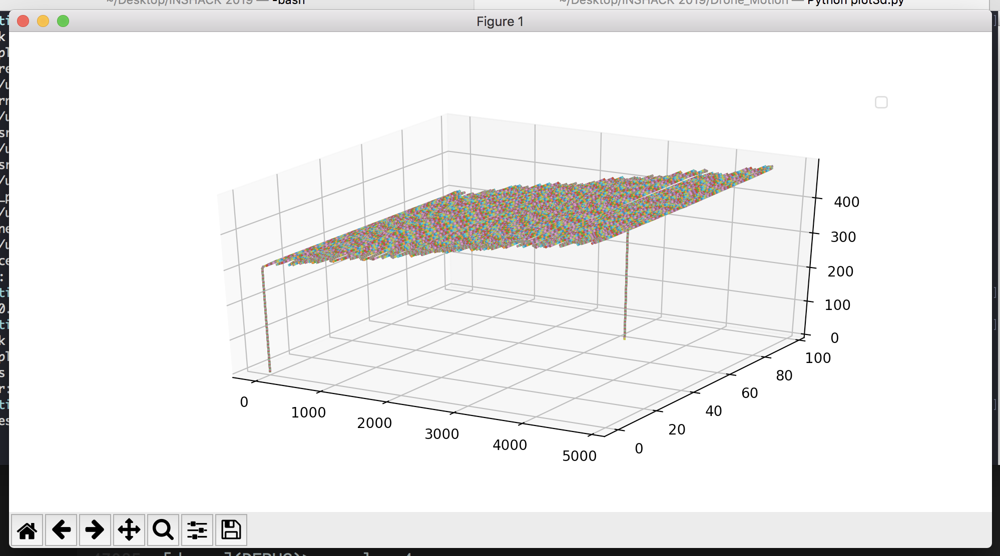
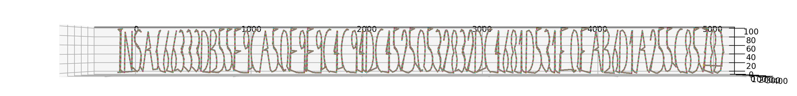

# Drone Motion
Forensics

## Challenge 

We intercepted a drone flying above a restricted area and retrieved a log from its memory card.

Help us find out what this drone was doing above our heads!

Flag must match the regex: `INSA\{[a-f0-9]+\}`

Hint 1 :

	The flag is expected to be a lowercase hexadecimal string. Do not mess things up with E and F, F has a shorter horizontal line in the middle.

## Solution

We are given a log file with direction coordinates.

(The directions are relative to current position)

Using matplotlib in python, I plotted the coordinates on a plane.

From this, we see that the drone flys up, then draws something (I presume the flag), then lands.

Hence, I panned the graph display until the flag is visible.

## Flag

	INSA{66333db55e9ca50e9e9c4c94dc45250532832dc4681d531f0fab6d1a255c8578}
