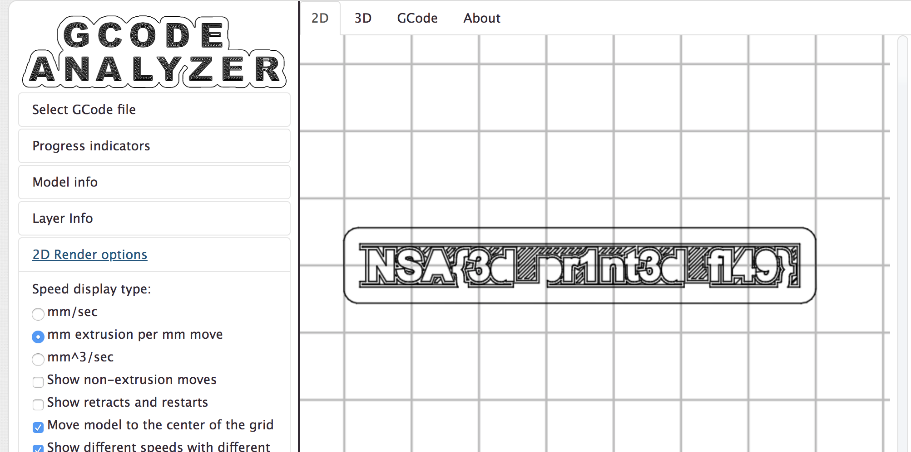

# gflag
Misc

## Challenge 

My brother likes esoteric programming. He sent me this file but I don't see what it is for. Could you help me ?

GFlag files

## Solution

Looks like G-code for 3D printers and CNC machines

Use this online viewer

http://gcode.ws/

## Flag

	INSA{3d_pr1nt3d_fl49}
