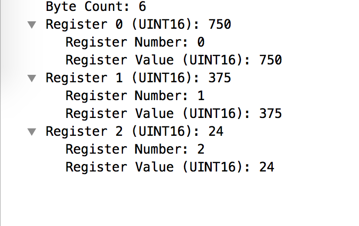
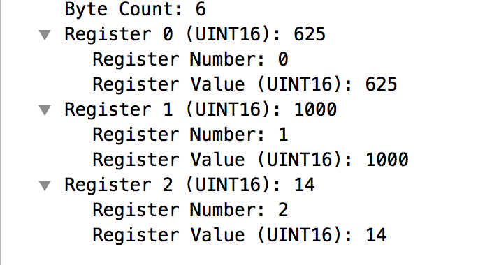
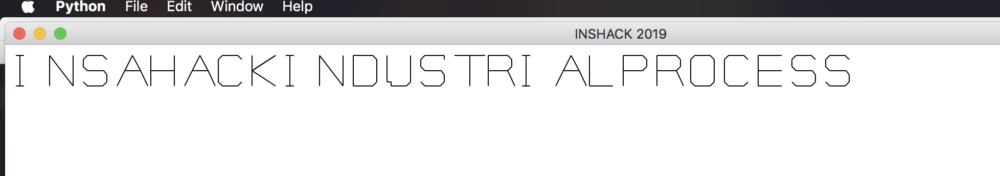

# industrial-process
Misc

## Challenge 

	In company XXX, we have a big expertise in laser cutting and we are well informed about cybersecurity. We have setup a small honeypot to simulate the cut of some pieces. In our fake process, we have manufactured 25 pieces of 1 meter by 1 meter. We have found this really weird file thanks to a super effective detection tool. There was also a weird string : 893c539a84e6c96acf5f2ceea2ad9ef7be895580

	This flag follow the following format : INSA([A-Z]*). Please submit it as INSA{$1}, for example if you find INSAAZERTY, submit INSA{AZERTY}. Weird File

## Solution

Search the string and we find the github repo
https://github.com/TryCatchHCF/Cloakify/tree/893c539a84e6c96acf5f2ceea2ad9ef7be895580

	 $ git clone https://github.com/TryCatchHCF/Cloakify

Decode `tempList.txt` and we get a PCAP file.

	Cloakify $ python decloakify.py ../tempList.txt ./ciphers/worldFootballTeams > out.txt
	Cloakify $ file out.txt 
	out.txt: pcap-ng capture file - version 1.0
	Cloakify $ mv out.txt out.pcapng

Open in wireshark, we see Modbus packets

- https://www.netresec.com/?page=Blog&month=2018-09&post=Reverse-Engineering-Proprietary-ICS-Protocols

- https://osqa-ask.wireshark.org/questions/59670/extract-particular-register-from-series-of-modbus-packets

We can extract register values into a text file, using this command

	Cloakify $ tshark -r out.pcap -Y "modbus.regval_uint16" -T fields -e modbus.regval_uint16 > registers.txt
	tshark: The file "out.pcap" appears to have been cut short in the middle of a packet.

Now we need to understand what the register values mean.

From the description `we have manufactured 25 pieces of 1 meter by 1 meter`...

From this, I can deduce the following which matches the above statement
	
	Register 0 = x-axis - ranges from 0 to 1000 (mm)
	Register 1 = y-axis - ranges from 0 to 1000 (mm)
	Register 2 = piece index - ranges from 0 to 24

Now, draw on a canvas

## Flag

	INSA{HACKINDUSTRIALPROCESS}
